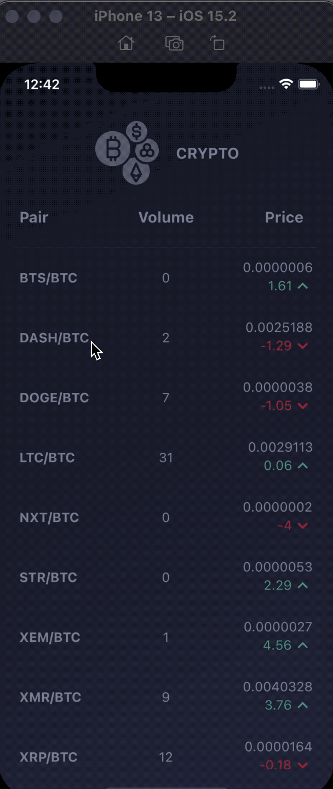
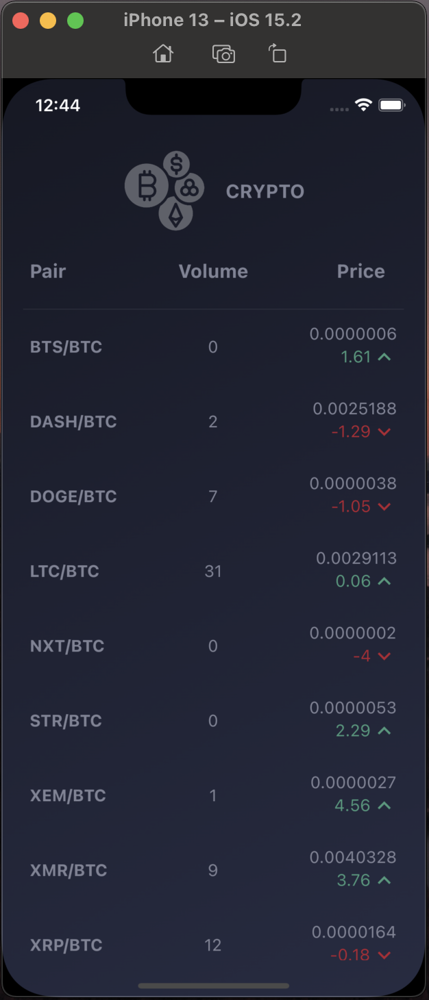
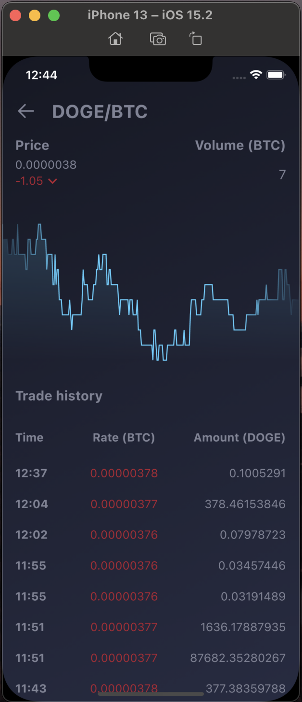

# Crypto info

<table>
  <tr>
    <td>Demo Gif</td>
    <td>List currencies</td>
    <td>Currency details</td>
  </tr>
  <tr>
    <td></td>
    <td></td>
    <td></td>
  </tr>
 </table>

## Start

1. Clone the repository.
2. Get dependencies
3. Code generation

```bash
flutter pub get
flutter pub run build_runner build
```


### Launching an application

We have two environments: dev and production. Then the file structure should be as follows:

**Production - main.dart**

Run:
```bash  
flutter run -t lib/main.dart  
```  

**Dev - main_dev.dart**

Run:
```bash  
flutter run -t lib/main_dev.dart  
```  

**Important:**
Each file must include configuration specific to the environment. It is allowed to declare it only in these files.
